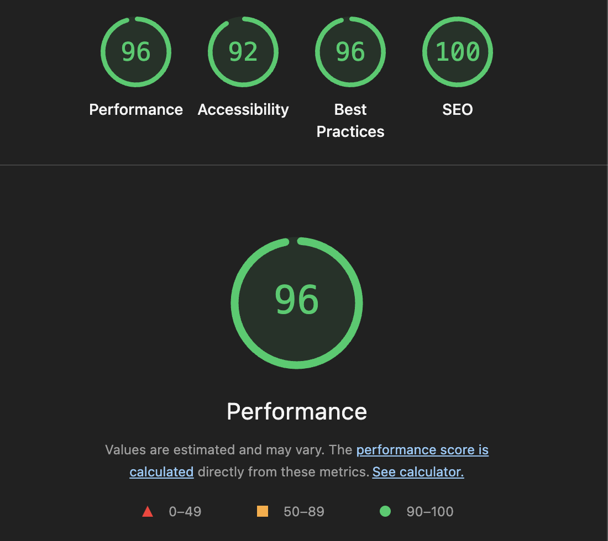

# Movie DB

A pet project to explore building a React-like framework from scratch using vanilla TypeScript.

Uses [The Movie DB API](https://developers.themoviedb.org/3/getting-started/introduction) as a playground to test the framework.

## The "Framework"

- **Tagged template literals** (`html`) for declarative UI
- **Functional components** returning `DocumentFragment`
- **Data-attribute event binding** (`data-on-click="handler"`)
- **Pub/sub state management** for reactive updates

```ts
const MyComponent = ({ title }) => {
  const template = html`<button data-on-click="onClick">${title}</button>`;
  const onClick = () => console.log('clicked');
  return createElement(template, { onClick });
};
```

## Lighthouse



## Running locally

```sh
yarn && yarn start
```

